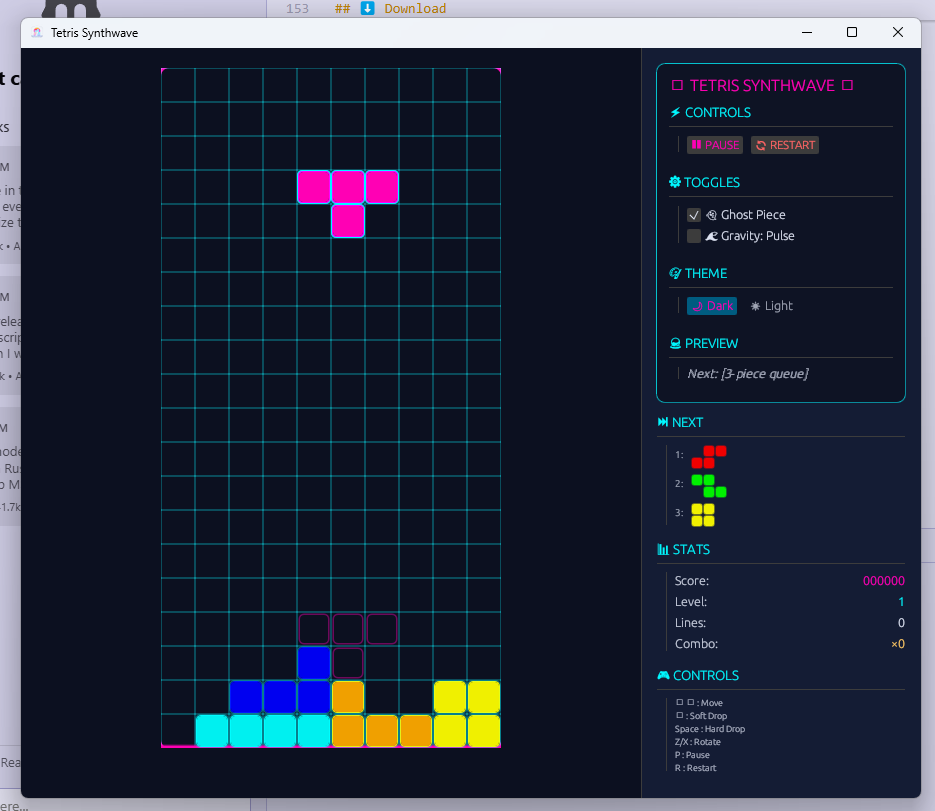
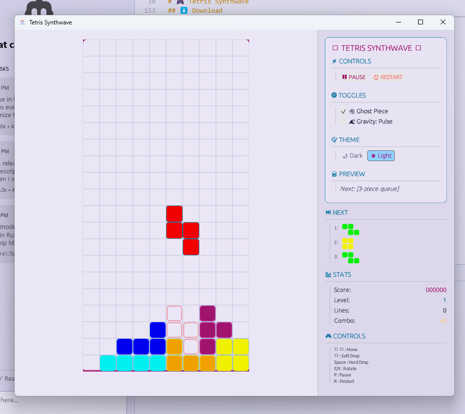

<div align="center">

```
╔══════════════════════════════════════════════════════════════════╗
║                                                                  ║
║  ████████╗███████╗████████╗██████╗ ██╗███████╗                 ║
║  ╚══██╔══╝██╔════╝╚══██╔══╝██╔══██╗██║██╔════╝                 ║
║     ██║   █████╗     ██║   ██████╔╝██║███████╗                 ║
║     ██║   ██╔══╝     ██║   ██╔══██╗██║╚════██║                 ║
║     ██║   ███████╗   ██║   ██║  ██║██║███████║                 ║
║     ╚═╝   ╚══════╝   ╚═╝   ╚═╝  ╚═╝╚═╝╚══════╝                 ║
║                                                                  ║
║      ███████╗██╗   ██╗███╗   ██╗████████╗██╗  ██╗              ║
║      ██╔════╝╚██╗ ██╔╝████╗  ██║╚══██╔══╝██║  ██║              ║
║      ███████╗ ╚████╔╝ ██╔██╗ ██║   ██║   ███████║              ║
║      ╚════██║  ╚██╔╝  ██║╚██╗██║   ██║   ██╔══██║              ║
║      ███████║   ██║   ██║ ╚████║   ██║   ██║  ██║              ║
║      ╚══════╝   ╚═╝   ╚═╝  ╚═══╝   ╚═╝   ╚═╝  ╚═╝              ║
║                                                                  ║
║              ██╗    ██╗ █████╗ ██╗   ██╗███████╗                ║
║              ██║    ██║██╔══██╗██║   ██║██╔════╝                ║
║              ██║ █╗ ██║███████║██║   ██║█████╗                  ║
║              ██║███╗██║██╔══██║╚██╗ ██╔╝██╔══╝                  ║
║              ╚███╔███╔╝██║  ██║ ╚████╔╝ ███████╗                ║
║               ╚══╝╚══╝ ╚═╝  ╚═╝  ╚═══╝  ╚══════╝                ║
║                                                                  ║
╚══════════════════════════════════════════════════════════════════╝
```

# 🎮 Tetris Synthwave

### *A modern, minimal, synthwave-themed desktop Tetris game built in Rust*

[](https://github.com/matt793/tetris-synthwave/releases)
[](LICENSE)
[](https://www.microsoft.com/windows)
[](https://www.rust-lang.org/)
[](https://github.com/matt793/tetris-synthwave/stargazers)

[**🎯 Features**](#-features) • [**⬇️ Download**](#-download) • [**🎮 How to Play**](#-how-to-play) • [**🚀 Quick Start**](#-quick-start) • [**📸 Screenshots**](#-screenshots) • [**🤝 Contributing**](#-contributing)

</div>

---

## 📑 Table of Contents

- 🌟 [Overview](#-overview)
- 🎯 [Features](#-features)
  - 🎮 [Core Gameplay](#core-gameplay)
  - ⚡ [Unique Mechanics](#unique-mechanics)
  - 🎨 [Visual Design](#visual-design)
  - ♿ [Accessibility](#accessibility)
- ⬇️ [Download](#-download)
  - 💿 [Windows Installers](#windows-installers)
  - 📋 [System Requirements](#system-requirements)
- 🎮 [How to Play](#-how-to-play)
  - ⌨️ [Controls](#️-controls)
  - 💎 [Power-Ups Guide](#-power-ups-guide)
  - 🏆 [Scoring System](#-scoring-system)
- 🚀 [Quick Start](#-quick-start)
  - 🔧 [Building from Source](#-building-from-source)
  - 📦 [Creating Installers](#-creating-installers)
- 🛠️ [Development](#️-development)
  - 📁 [Project Structure](#-project-structure)
  - 🧪 [Testing](#-testing)
  - 📊 [Performance](#-performance)
- ⚙️ [Configuration](#️-configuration)
- 📸 [Screenshots](#-screenshots)
- 🗺️ [Roadmap](#️-roadmap)
- 🤝 [Contributing](#-contributing)
- 📄 [License](#-license)
- 🙏 [Acknowledgments](#-acknowledgments)

---

## 🌟 Overview

**Tetris Synthwave** brings the classic block-stacking puzzle game into the modern era with a stunning synthwave aesthetic, smooth gameplay mechanics, and innovative power-up systems. Built with **Rust** for blazing-fast performance and **eframe/egui** for a lightweight, responsive UI.

<div align="center">

### ✨ Why Tetris Synthwave?

| Feature | Benefit |
|---------|---------|
| 🦀 **Pure Rust** | Lightning-fast performance with memory safety |
| 🎨 **Synthwave Theme** | Beautiful neon aesthetics with dual themes |
| ⚡ **60 FPS** | Smooth, responsive gameplay |
| 💾 **< 5MB Installer** | Lightweight and efficient |
| 🔧 **Zero Dependencies** | No runtime requirements |
| 🎮 **Modern Mechanics** | SRS, 7-bag, hold, ghost pieces |

</div>

---

## 🎯 Features

### Core Gameplay

<div align="center">

| ✅ Feature | Description |
|-----------|-------------|
| **10x20 Board** | Classic Tetris dimensions |
| **7 Tetrominoes** | I, O, T, S, Z, J, L pieces |
| **Super Rotation System** | Modern rotation with wall kicks |
| **7-Bag Randomizer** | Fair piece distribution |
| **Ghost Pieces** | See where pieces will land |
| **Hold Function** | Save a piece for later |
| **Soft & Hard Drop** | Precise piece control |
| **Level Progression** | Increasing difficulty |

</div>

### Unique Mechanics

#### ⚡ **Combo Chain System**
- 🔥 Build multipliers up to **5x** by clearing lines consecutively
- ⏱️ 2.5-second window between clears to maintain combo
- 📊 Visual combo counter with neon effects

#### 💎 **Power Cells** *(5% spawn rate)*
Special glowing blocks that trigger effects when cleared:

| Power-Up | Effect | Duration |
|----------|--------|----------|
| 🌟 **Nova** | Clears adjacent blocks (radius 1) | Instant |
| ⏰ **Slow Time** | Reduces gravity by 50% | 5 seconds |

#### 🌊 **Gravity Modes**
- **Normal**: Standard constant gravity
- **Pulse**: Oscillating gravity (8-second sine wave)

### Visual Design

- 🌃 **Dark Theme**: Deep navy gradients with neon magenta/cyan accents
- ☀️ **Light Theme**: Soft pastels with muted neon highlights
- 📐 **Grid Lines**: Clear visual boundaries on the playfield
- 🔤 **Typography**: Clean, modern Inter font
- ✨ **Effects**: Subtle animations without strobing

### Accessibility

- ♿ **No Rapid Flashing**: Safe for photosensitive users
- 🎨 **High Contrast**: WCAG AA compliant color ratios
- ⚙️ **Customizable**: Adjustable settings and controls
- 🔇 **Visual-Only**: No audio dependencies

---

## ⬇️ Download

### Windows Installers

<div align="center">

| Architecture | Download | Size | SHA256 |
|--------------|----------|------|--------|
| **x64** (Most PCs) | [📥 tetris-synthwave-0.2.0-x86_64.msi](https://github.com/matt793/tetris-synthwave/releases/download/v0.2.0/tetris-synthwave-0.2.0-x86_64.msi) | 5.1 MB | `pending` |
| **ARM64** (Surface Pro X) | [📥 tetris-synthwave-0.2.0-aarch64.msi](https://github.com/matt793/tetris-synthwave/releases/download/v0.2.0/tetris-synthwave-0.2.0-aarch64.msi) | 5.1 MB | `pending` |

</div>

> 💡 **Not sure which version?** Most Windows PCs use x64. ARM64 is for newer ARM-based devices like Surface Pro X.

### System Requirements

| Component | Minimum | Recommended |
|-----------|---------|-------------|
| **OS** | Windows 10 1809+ | Windows 11 |
| **CPU** | 1 GHz dual-core | 2 GHz quad-core |
| **RAM** | 2 GB | 4 GB |
| **Storage** | 50 MB | 100 MB |
| **Graphics** | DirectX 11 | DirectX 12 |

---

## 🎮 How to Play

### ⌨️ Controls

<div align="center">

| Key | Action | Description |
|-----|--------|-------------|
| **←/→** | Move | Shift piece horizontally |
| **↓** | Soft Drop | Accelerate fall |
| **Space** | Hard Drop | Instant placement |
| **Z** | Rotate CCW | Counter-clockwise rotation |
| **X** | Rotate CW | Clockwise rotation |
| **C** | Hold | Save piece for later |
| **G** | Ghost Toggle | Show/hide ghost piece |
| **M** | Music Toggle | Toggle music on/off |
| **T** | Theme | Toggle light/dark theme |
| **P** | Pause | Pause/resume game |
| **R** | Restart | Start new game |
| **Esc** | Quit | Exit to desktop |

</div>

### 🎵 Music & Audio

**Tetris Synthwave** features a dynamic music system with randomized synthwave tracks:

- **🎶 Randomized Playlist**: Each session plays tracks in a different order with no repeats until all songs have played
- **🔇 Silent Gaps**: 4+ second breaks between tracks for a non-intrusive experience  
- **🎚️ Volume Envelope**: Tracks fade in and out smoothly with configurable volume curves
- **🎛️ Music Controls**: Toggle music with the 'M' key or adjust settings in-game
- **📀 Track Display**: Current playing track is shown in the sidebar


### 💎 Power-Ups Guide

<details>
<summary><b>📈 Combo Chains</b> (click to expand)</summary>

Build impressive combos by clearing lines in quick succession:

| Consecutive Clears | Multiplier | Points Bonus |
|-------------------|------------|--------------|
| 2 clears | 2x | +200% |
| 3 clears | 3x | +300% |
| 4 clears | 4x | +400% |
| 5+ clears | 5x | +500% (MAX) |

> ⏰ **Tip**: You have 2.5 seconds between clears to maintain your combo!

</details>

<details>
<summary><b>✨ Power Cells</b> (click to expand)</summary>

Special glowing blocks appear randomly (~5% chance) and grant powers when cleared:

**🌟 Nova Effect**
- Clears all blocks in a 1-block radius
- Great for creating openings
- Instant effect

**⏰ Slow Time**
- Reduces gravity by 50%
- Lasts for 5 seconds
- Perfect for complex maneuvers

</details>

### 🏆 Scoring System

| Action | Points | Level Multiplier |
|--------|--------|------------------|
| Single Line | 100 | × Level |
| Double | 300 | × Level |
| Triple | 500 | × Level |
| Tetris (4 lines) | 800 | × Level |
| Soft Drop | 1 | per row |
| Hard Drop | 2 | per row |

---

## 🚀 Quick Start

### Prerequisites

- 🦀 [Rust](https://rustup.rs/) (stable toolchain)
- 📦 [Git](https://git-scm.com/)
- 🔧 [WiX Toolset](https://wixtoolset.org/) 3.14+ *(optional, for building installers)*

### 🔧 Building from Source

```bash
# Clone the repository
git clone https://github.com/matt793/tetris-synthwave.git
cd tetris-synthwave

# Run the game (debug mode)
cargo run

# Run optimized for best performance
cargo run --release
```

### 📦 Creating Installers

<details>
<summary><b>Building Windows MSI Installers</b> (click to expand)</summary>

```bash
# Install cargo-wix
cargo install cargo-wix

# Build for x64
cargo build --release --target x86_64-pc-windows-msvc
cargo wix --target x86_64-pc-windows-msvc --no-build

# Build for ARM64
rustup target add aarch64-pc-windows-msvc
cargo build --release --target aarch64-pc-windows-msvc
cargo wix --target aarch64-pc-windows-msvc --no-build
```

MSI files will be created in `target/wix/`

</details>

---

## 🛠️ Development

### 📁 Project Structure

```
tetris-synthwave/
├── 📂 src/
│   ├── 📄 main.rs          # Entry point & window setup
│   ├── 📄 app.rs           # Application state management
│   ├── 📂 game/            # Core game logic
│   │   ├── 📄 mod.rs       # Game state machine
│   │   ├── 📄 board.rs     # Board representation
│   │   ├── 📄 piece.rs     # Tetromino definitions
│   │   ├── 📄 random.rs    # 7-bag randomizer
│   │   └── 📄 scoring.rs   # Points & levels
│   └── 📂 ui/              # User interface
│       ├── 📄 mod.rs       # UI coordination
│       ├── 📄 theme.rs     # Synthwave themes
│       ├── 📄 panel.rs     # Sidebar components
│       └── 📄 draw.rs      # Board rendering
├── 📂 assets/              # Game resources
│   └── 🎨 Icon/           # Application icons
├── 📂 wix/                 # Installer configs
└── 📄 Cargo.toml          # Dependencies
```

### 🧪 Testing

```bash
# Run all tests
cargo test

# Run tests with output
cargo test -- --nocapture

# Run specific test
cargo test test_name
```

### 📊 Performance

<div align="center">

| Metric | Target | Actual |
|--------|--------|--------|
| **Frame Rate** | 60 FPS | ✅ 60 FPS |
| **Memory Usage** | < 50 MB | ✅ ~30 MB |
| **Startup Time** | < 1s | ✅ ~0.5s |
| **Input Latency** | < 16ms | ✅ ~8ms |

</div>

### 🎯 Code Quality

```bash
# Format code
cargo fmt

# Run clippy linter
cargo clippy -- -D warnings

# Check for security vulnerabilities
cargo audit
```

---

## ⚙️ Configuration

Settings are automatically saved to your system's config directory:

| Platform | Location |
|----------|----------|
| **Windows** | `%APPDATA%\tetris-synthwave\settings.json` |
| **Linux** | `~/.config/tetris-synthwave/settings.json` |
| **macOS** | `~/Library/Application Support/tetris-synthwave/settings.json` |

### Configuration Options

```json
{
  "theme": "dark",           // "dark" or "light"
  "ghost_enabled": true,     // Show ghost pieces
  "gravity_mode": "normal",  // "normal" or "pulse"
  "high_score": 0,           // Automatically tracked
  "volume": 0.7,             // Reserved for future audio
  "keybindings": {           // Customizable controls
    "move_left": "Left",
    "move_right": "Right",
    "soft_drop": "Down",
    "hard_drop": "Space",
    "rotate_cw": "X",
    "rotate_ccw": "Z",
    "hold": "C",
    "pause": "P"
  }
}
```

---

## 📸 Screenshots

<div align="center">

### 🌃 Dark Mode

*Experience the neon-soaked synthwave aesthetics with deep navy backgrounds and vibrant magenta/cyan accents*

### ☀️ Light Mode

*Enjoy soft pastels with muted neon highlights for comfortable daytime gaming*

</div>

---

## 🗺️ Roadmap

### Version 0.2.0 (Q1 2025)
- [x] 🎵 **Music Playback** - Randomized synthwave tracks with 4+ second gaps and volume envelope
- [ ] 🎮 Online leaderboards
- [ ] 🏆 Achievement system
- [ ]  Challenge modes

### Version 0.3.0 (Q2 2025)
- [ ] 🌐 Multiplayer support
- [ ] 📱 Mobile version
- [ ] 🎨 Custom themes
- [ ] 🔄 Replay system

### Future Ideas
- [ ] 👤 Player profiles
- [ ] 📊 Statistics tracking
- [ ] 🎪 Tournament mode
- [ ] 🧩 Custom piece sets

---

## 🤝 Contributing

We welcome contributions! Please see our [Contributing Guide](CONTRIBUTING.md) for details.

### How to Contribute

1. 🍴 Fork the repository
2. 🌿 Create a feature branch (`git checkout -b feature/amazing-feature`)
3. 💾 Commit changes (`git commit -m 'Add amazing feature'`)
4. 📤 Push to branch (`git push origin feature/amazing-feature`)
5. 🔄 Open a Pull Request

### Development Guidelines

- 🎯 Follow Rust conventions
- ✅ Add tests for new features
- 📝 Update documentation
- 🔍 Ensure `cargo clippy` passes
- 🎨 Run `cargo fmt` before committing

---

## 📄 License

This project is licensed under the **MIT License** - see the [LICENSE](LICENSE) file for details.

```
MIT License

Copyright (c) 2024 Tetris Synthwave Contributors

Permission is hereby granted, free of charge, to any person obtaining a copy
of this software and associated documentation files (the "Software"), to deal
in the Software without restriction...
```

---

## 🙏 Acknowledgments

### Special Thanks

- 🦀 **Rust Community** - For the amazing language and ecosystem
- 🎨 **egui Team** - For the fantastic immediate-mode GUI library
- 🎮 **Alexey Pajitnov** - Creator of the original Tetris
- 🌃 **Synthwave Artists** - For the aesthetic inspiration
- 🤖 **Vibe Coded** - This project was developed with AI assistance, bringing modern development practices to classic gaming

### Technologies Used

<div align="center">

[](https://www.rust-lang.org/)
[](https://github.com/emilk/egui)
[](https://wixtoolset.org/)
[](https://github.com/features/actions)

</div>

---

<div align="center">

### 🌟 Star this repo if you enjoy the game!

Made with ❤️ and 🦀 Rust

[⬆ Back to Top](#-tetris-synthwave)

</div>
